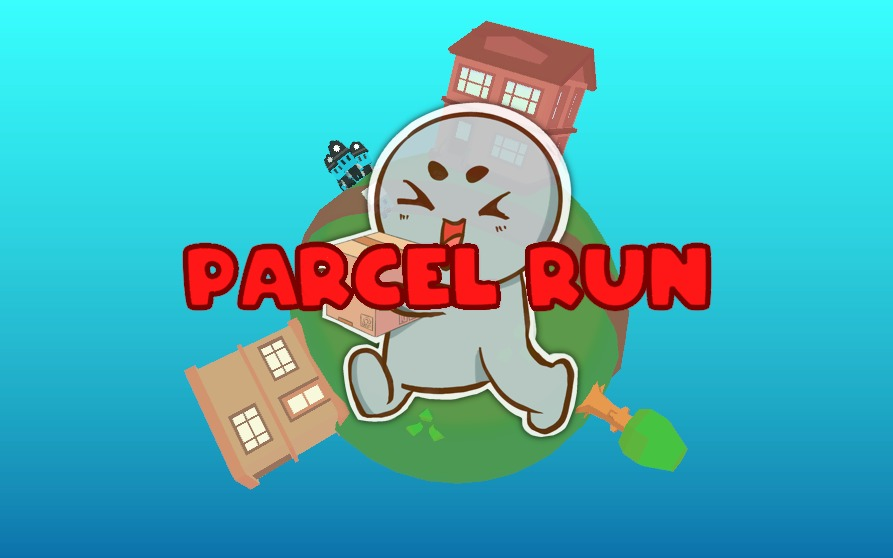

# Parcel Run

In the near future, delivering parcels is a crime! Only a select few corporations are allowed and you’re not one of them. But that’s not about to stop you from trying! The authorities will stop you, of course - but you’ll put on one heck of a show before then!

<p align="center">
  
   <sup><i>This game was designed around the theme <i>Delay The Inevitable</i> for <a href="https://ldjam.com/events/ludum-dare/50/parcel-run">Ludum Dare 50</a>.</i></sup>
</p>

## Table of Contents
1. [Additional Information](#additional-information)
2. [Getting Started](#getting-started)
    * [Prerequisites](#prerequisites)
    * [Installing](#installing)
3. [Built With](#built-with)
4. [Authors](#authors)

## Additional Information
Just like the other Gamejam projects which I have worked on in the past, I decided it would be fun to spend some time refactoring a few of them! 

This repository was originally a GitLab repository, and it has been imported onto GitHub.

*All commits from 02/04/22 - 05/04/22 are commits made during the gamejam.*

## Getting Started

These instructions will get you a copy of this game project up and running on your local machine for development and testing purposes.
If you just want to play the game, you can play on a web browser or download it for Windows on the [Parcel Run Itch.io Page](https://horsehead.itch.io/parcel-run)

### Prerequisites
[](https://unity3d.com/get-unity/download/archive)

### Installing
Here is how you can get the game running for development and testing purposes:
```
1. Download the project 
2. Launch Unity Hub
3. Press 'Add' on the top right corner of the hub
4. Navigate to the directory where the project was downloaded
5. Open with the specified Unity version
```

## Built With
* [Unity](https://unity3d.com/get-unity/download/archive) - The game engine used
* [Visual Studio 2019](https://visualstudio.microsoft.com/downloads/) - The IDE used

## Authors
* **Amy Elliott** - *Initial Gamejam Development & Refactoring* 
* **Joe Shanahan** - *Initial Gamejam Development* - [Portfolio](https://www.3djoe.co.uk/) 
